# Digital Nomads
Digital Nomads is a website that allows developers to share their experiences outside the office. The app is a forum/blog type of website designed to allow Users to convey their personal experiences as Digital Nomads.
A platform where Users can share their adventures, tips and recommendations when working and exploring the world.

No desks, no cubicles, no offices.


# Live Project
- The live website can be found [here](https://digital-nomad.herokuapp.com/).

# Purpose of the website:
- To provide a platform where users can share their stories as digital nomads.
- To promote the idea that developers can be flexible on the job while working and traveling.
- To create a community and connect users in a "guild" of like-minded people.
- To allow users to share their ideas and help each other both in front and behind the screen.

# Design:
The website was designed with the intent to allow users to browse posts easily and perform all CRUD functionalities. It relied heavily on colors that should be appealing to the user, especially for those who might use the website on a daily basis.

For such, it makes use of a colour palette of a mere greenish, brownish, and yellowish blend for the navigation bar.
This gives a rustic feeling that is often associated with the nomadic camper life at the beach, desert, and mountains.

The background is best defined by a grayish white and the body of the post white, bordered by dashed lines.
The buttons in the post borrow the same patterns and render a shadow beneath them to contrast the body from the page. This gives the illusion that the User is writing a post on a piece of paper/document.

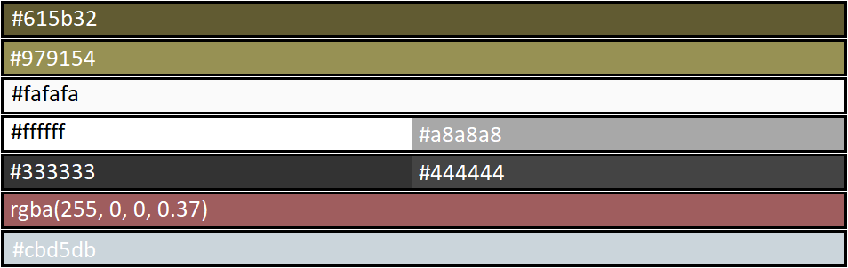

For a website where its functionality consists essentially of writing and reading articles, the fonts used for this website were "Audiowide" and "Staatliches." A choice that should appeal to a user's readability and block them from distractions or a complex design. The fonts and logo on the navigation bar are dyed in white, while the body presents itself with a dark grayish tone that doesn't stand too much from the article.
Links in the navigation bar are highlighted by a white tone when hovered, and bold when active. Links change color upon hover, particularly the title of the post, the username in a post/comment, the social media links and links that redirect users to other pages.
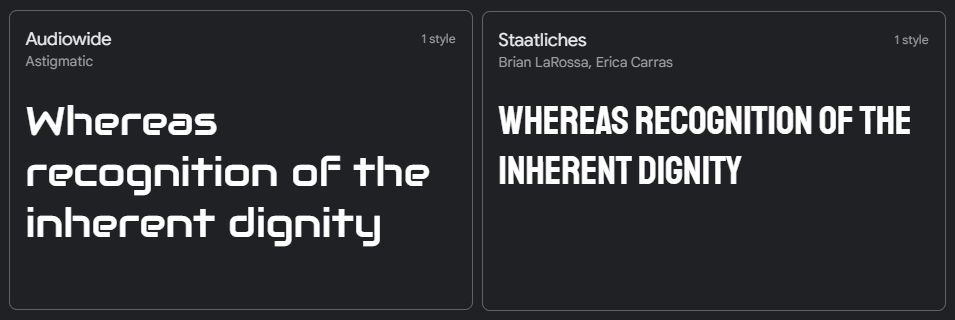

Icons were also integrated into the website to give a much more appellant aesthetic touch and association of functionality of the website.
The navigation bar, footer, and pages in the body make use of icons. The logo states "Digital Nomads" and is animated by an icon to give the idea that devs are on the move. Red was the chosen color to highlight it from the rest of the name.
Both the header and footer have an image attached to them of somebody networking, to give the impression that they are typing and reading posts. Hence the screen at the top and the user hands at the bottom.

The Fonts displayed in this website were imported from Google Fonts, the Icons displayed in the Footer imported from FontAwesome and Boxicons.

# Wireframes
The structure of the website is coherent and the base.html is present on all pages. The skeleton of the body is consistent for the whole website.
The Website can be more or less defined for its complexity like this:

- Reading the Home page:
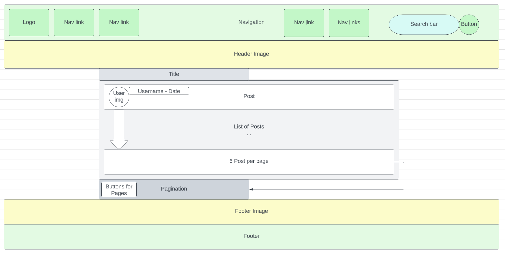

- Reading the About page:
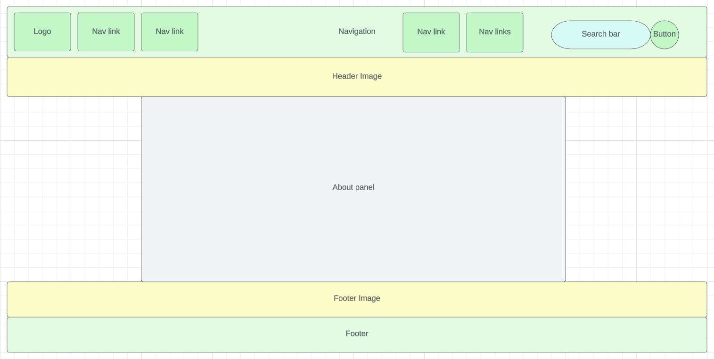

- Reading, Editing or Deleting a Post:
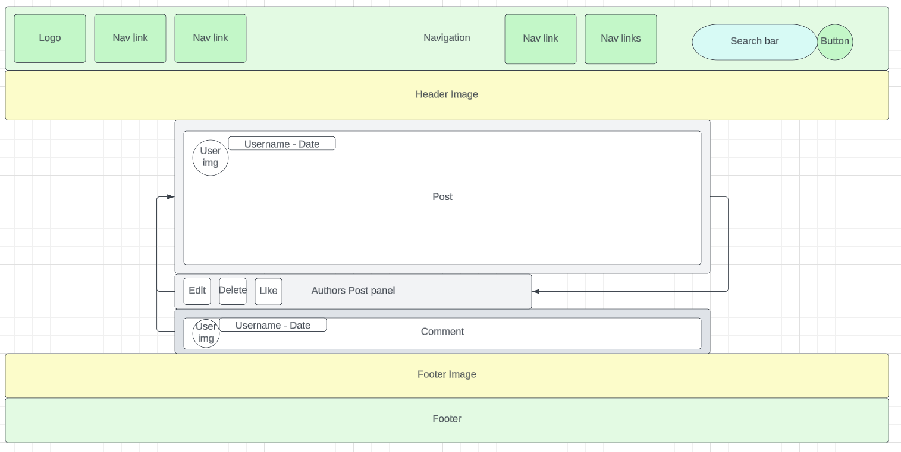

- Creating a Post:
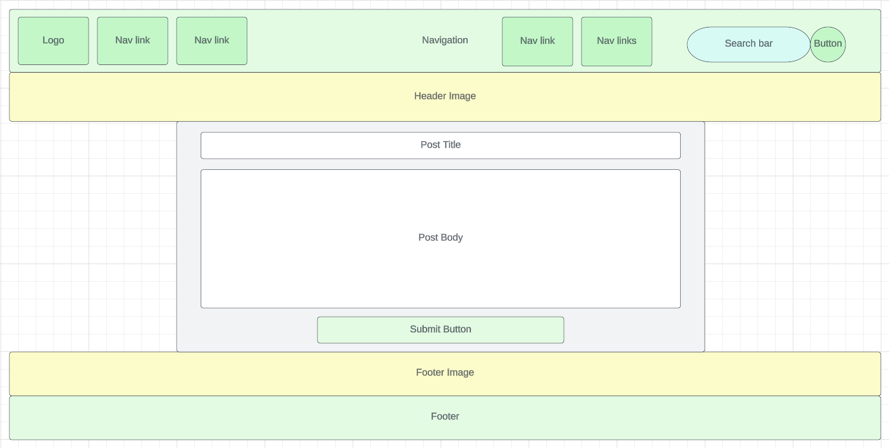

- Registering an Account:
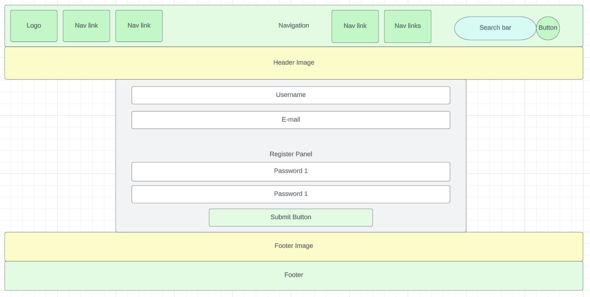

- Reading Posts by a User


- Using the Search functionality and retrieving Posts
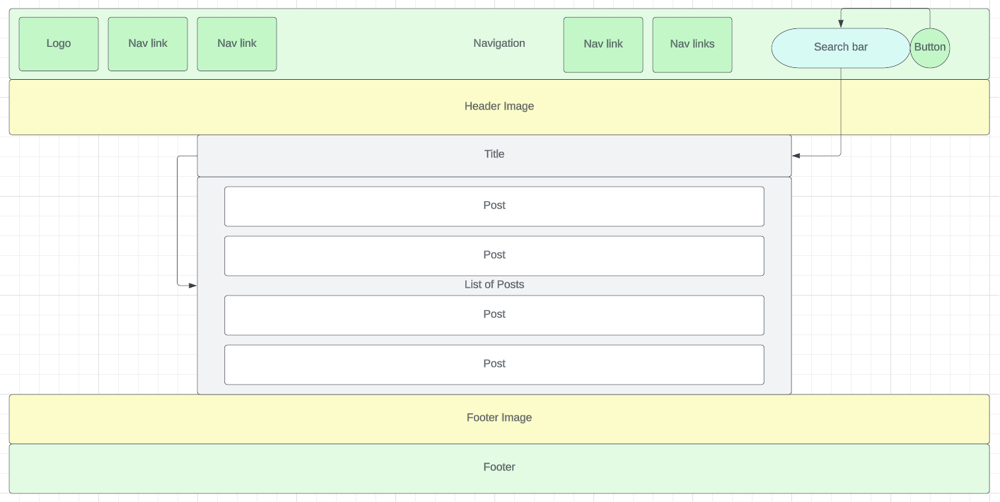

## Relationship Diagram

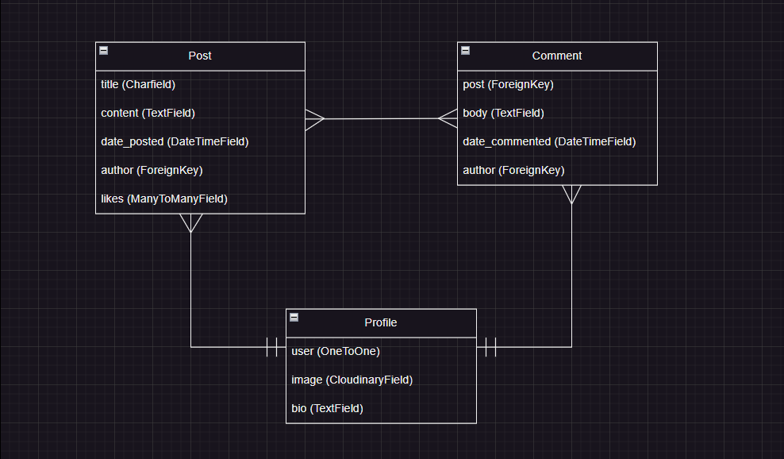

## Navbar, Header & Favicon
- The Navbar features from left to right the [Logo], [Home], [About], [Login], [Register] and the [Search] fields. Furthermore, for Users who are logged in, the [Post], [Profile] and [Logout] links.
- The links guide Users to the respective pages and remain "active" when and if on that page, with the exception of [Post].
- The Header features an image that splits in half, sharing the rest with the Footer.
- On the browser's tab, the Favicon and Logo of the website can be found, a red cog.

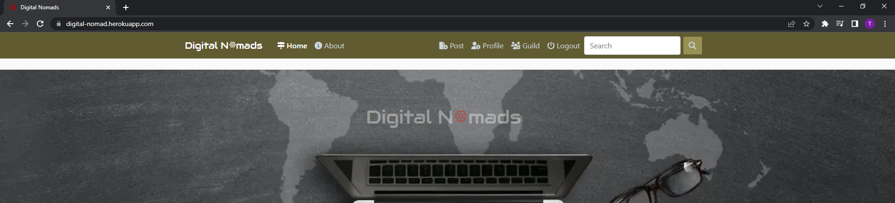

## Footer
- The Footer is best defined by Bootstrap's template. It features a slogan on the left side and on the right, the Social Media links. At the very bottom, a copyright notice.
- Above the Footer is the rest of the image shared with the Header: the keyboard of a laptop.
- Users can open the Social Media links and respective pages on new tabs.

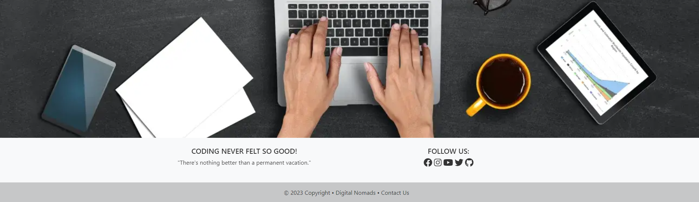

## Home: Posts & Pagination
- The homepage displays all of the posts that users create.
- If users are logged in, they are greeted with a message followed by their usernames.
- If no posts are present on the homepage, a message is displayed encouraging users to create a post.

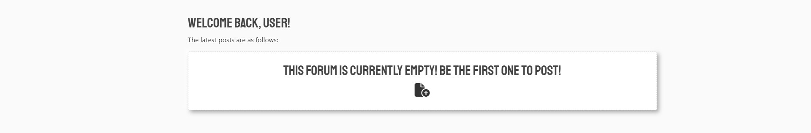

- If the forum has been populated with posts, then the posts are displayed and organized in a vertical fashion, with the newest at the top and the oldest at the bottom.
- For each post, the username, picture, date, title, and body (truncated by 50 words) are displayed.
- For every 6 posts, a new page for pagination is created, allowing users to easily navigate from page to page.

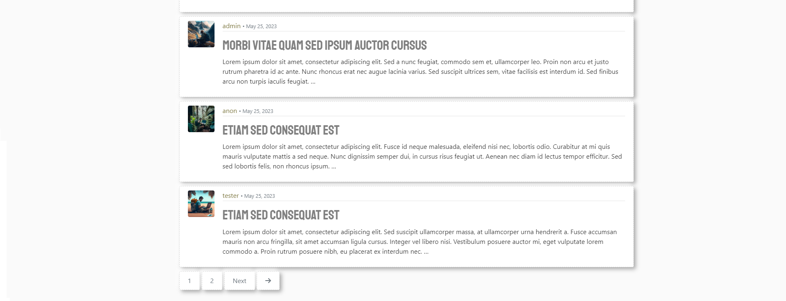

## About
- The About page renders a small section of advertisement and information about the website. It also encourages users to either Log in or Register an account.

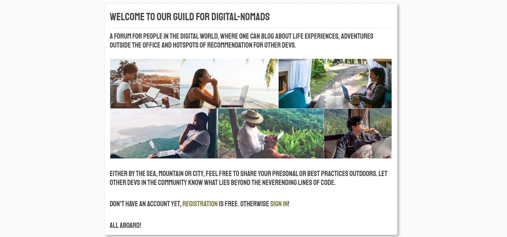

## Posts & Comments
- When opening a Post, the details of that particular Post is expanded, allowing Users to read the whole article.
- Users can read and engage with the Post, by leaving Comments and Likes, when clicking the respective buttons.


## Search Field
- Users can use the Search functionality.
- Upon making a valid search, the page should retrieve a list of Threads by a word populated either in the Title, Body or Username of a Post.

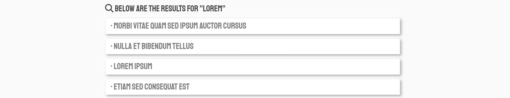

- If no Post exhibits such word, then a template prompts Users to give in a valid word.


- Otherwise, if no word was introduced in the search field, Users are requested to input a valid word/character.


## User Profile
- The User profile can be best defined as a "Settings panel" where users can update their personal info.
- The fields that can be updated include Username, Profile picture, E-mail and Bio.
- By default, the users profile picture is the logo of the website.

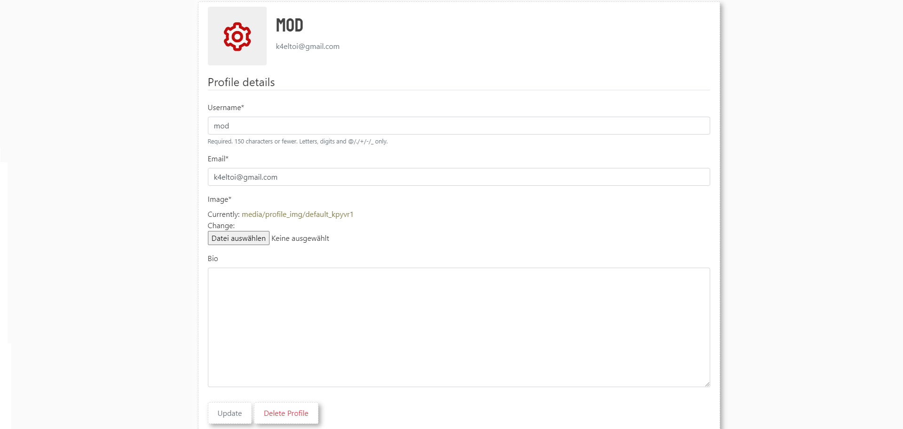

- Upon updating the Bio the User should have an Overview field.

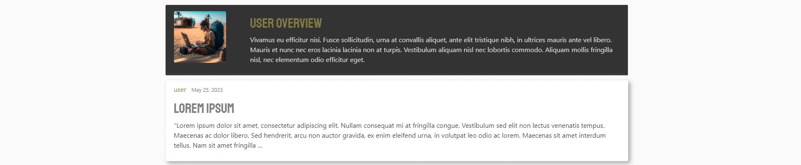

- If a User created an account, but did not make any Posts, even though made a Comment. The User profile remains inactive. This compels users to Post.

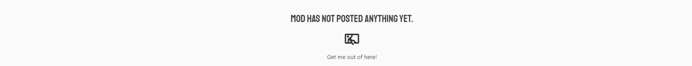

## Registration & Deletion
- The Registration page requests Users to input a Username, E-mail and Password.

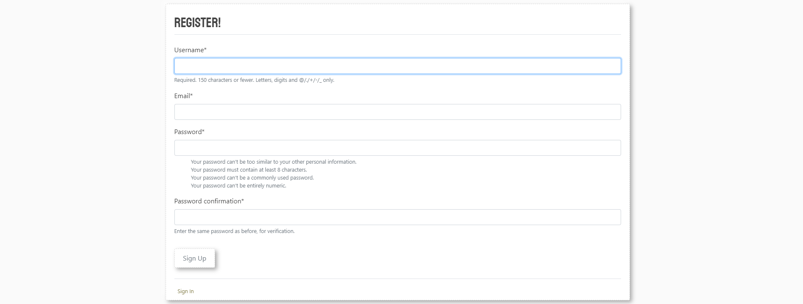
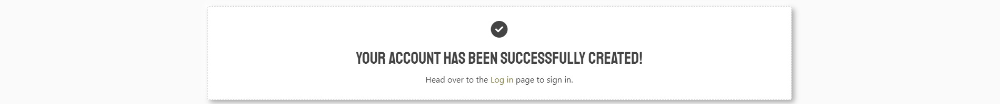


## Log in/out
- The Log in page demands Users to input valid credentials, as per registered.

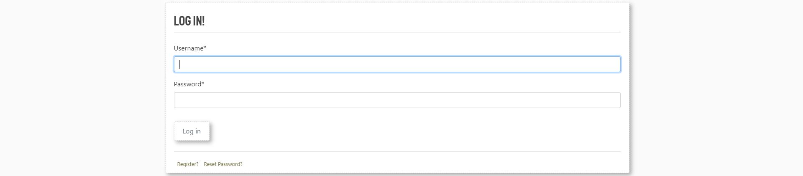

- By Logging out, Users are fired with a farewell message.

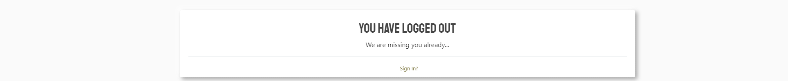

## Deletion
- If a User deletes the Profile/account, then the User is automatically logged out and the account eliminated. (This includes all Posts, Comments, Porfile Image and Username)

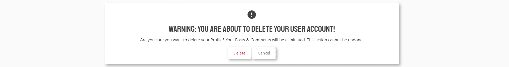

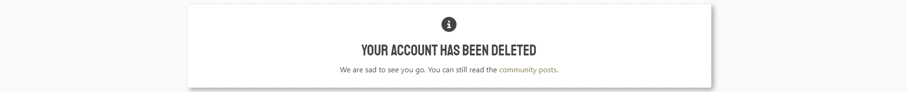

## Error 404
- If a User goes to a non-defined URL, then a 404 Error template is rendered, requesting users to leave that page.

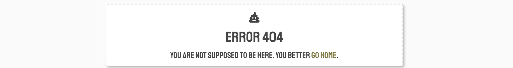


# Features and Functionality for Non-Registered Users, Registered Users, and Superusers
## Non-Registered Users (Visitors):
- Visitors can read all posts from /home/.
- Visitors can read all users' posts from /username/.
- Visitors can create a user account through /register/.
- Visitors can navigate to the Home/About/Login/Register pages.
- Visitors can navigate through the pagination of /home/ and /username/.
- Visitors can access external links on users posts/comments and footer.

## Registered Users (CRUD) can do the above as a Visitor, moreover:
- Users can log in/out through the "Log In/Out" functionality.
- Users can create posts through the "Post" functionality.
- Users can update their posts through the "Update" functionality.
- Users can delete their posts through the "Delete" functionality.
- Users can like/dislike all posts through the "Like/Dislike" functionality.
- Users can navigate to the Profile tab and update their "Bio".
- Users can navigate to the Profile tab and upload a profile picture.
- Comments cannot be deleted by anyone except Superusers.

## Superusers can manipulate information through the /admin/ panel:
- CRUD posts.
- Change passwords.
- Create/update/delete users.
- Delete comments.
- Promote users to Superuser.

## Planning & Agile:
This project was planned using Agile methodology and MoSCoW prioritization.

For this purpose, the project was illustrated by one Milestone entitled "Submit the project to CI before Deadline," providing the developer with the freedom to accomplish all issues/tasks flexibly before dates deadline.
Throughout the development process, new issues were added/removed, starting from "Todo," progressing to "In Progress," and finally being finalized in "Done".
The issues were assigned to the sole developer and labeled as "could-have," "should-have,", "must-have" and "won't -have".

In order of priority, with 21 User Stories, the [Project](https://github.com/users/TiagoMA90/projects/7/views/1) has:
## must-have:
- Register a user account
- Log into a User account
- Log out from a User account
- Create Posts
- Open Posts
- Read Posts
- Edit Posts
- Delete Posts
## should-have
- Upload a Profile picture
- Delete a User Account
- Reset the Password via E-mail
- Navigate through Pagination
- Add/Remove Likes
- View number of Likes
- Write Comments
- View Comments
## could-have
- Write a User Profile/Bio
- Update user Info
- Filter Posts through the Search bar
- Fileter Post by Username
## wont-have
- Create Posts using ckeditor

Once completed, the issues were marked as "done" and the milestone consequently closed.

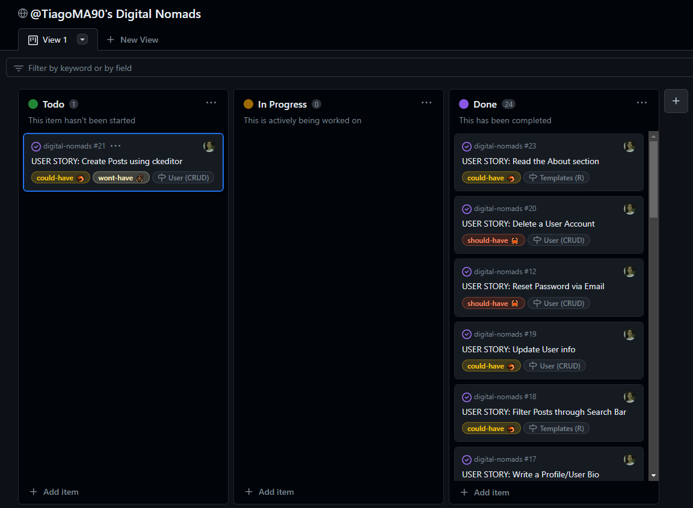
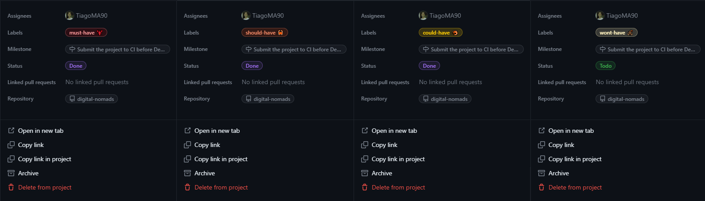

## Ideas to Implement in the future:
The Developer would like to:
- add a tab with a list of all Registered Users.
- add a tab with a chatroom for Registered Users.
- reinstate ckedior

## Development Process
The project started out as a forum for Ads of Events, where users could post events taking place at a certain time in a certain location.
Users would open up a thread, give a brief description of the event, target the location with Google Maps API, and set the date. After an event took place, it would be automatically deleted.

In the end, this project was simplified due to deadline limitations and time constraints. It makes good use of familiar concepts such as Create Read Update Delete.
Upon re-creating this project, the developer rethought the idea of a "forum" or "discussion board," similar to [reddit](https://www.reddit.com/), but more focused on the nomadic lifestyle.

# Development & Deployment
The project was developed using GitHub and GitPod platforms...
- Navigate to: "Repositories" and create "New".
- Mark the following fields: ✓ Public ✓ Add a README file.
- Select template: "Code-Institute-Org/python-essentials-template".
- Add a Repository name: "digital-nomads".
- ...and create Repository.

... and suffered various executions using the inbuild Terminal.

For Commits on this project, the following commands ran:
- ```git add .``` <- Stages before commiting.
- ```git commit -m "written imperative declaration"``` <- Declares changes and updates.
- ```git push``` <- Push all updates to the GitHub Repository.

To run the server locally (Debug = True), the following command ran:
- ```python manage.py runserver``` <- Loads the website on the in-built Terminal.

During development migrations to the database were made.
To make migrations the following commands ran:
- ```python manage.py makemigrations``` <- Creates a new database migration
- ```python manage.py migrate``` <- Applies pending migrations

To create a new Django project, in the currenct directory, the followig command ran:
- ```django-admin startproject NAMEOFTHEPROJECT .``` <- Starts the project

To create the app the following command ran:
- ```python3 manage.py startapp NAMOFTHEAPP``` <- Creates a folder for the app withing the project

To install Django libraries and Set up:
From the new workspace, navigate to the Terminal and run:

- ```pip3 install 'django<4' gunicorn``` <-Runs the /admin

To install the supporting libraries the following command ran:
- ```pip3 install dj_database_url==0.5.0 psycopg2``` <- Installs Python packages and PostgreSQL adapter

To install Cloudinary the following command ran:
- ```pip3 install dj3-cloudinary-storage``` <- Installs Cloudinary

To install AlAuth the following command ran:
- ```pip3 install django-allauth``` <- Installs allauth

To istall crispy-forms the following command ran:
- ```pip3 install django-crispy-forms==1.14.0```  <- Installs crispy

To install Pillow the following command ran:
- ```pip3 install django Pillow``` <- Installs Pillow

To install Summernote the following command ran:
- ```pip3 install django-summernote``` <- Installs summernote((!) Unisntalled/or Ignored by the Developer)

To install Ckeditor, the folowing command ran:
- ```pip install django-ckeditor``` <- Installs ckeditor((!) Uninstalled/or Ignored by the Developer)

To create or update Requirements.txt, the following command ran:
- ```pip3 freeze --local > requirements.txt```  <-Runs the requirements

To install the requirements set on Requirements.txt the following command ran:
- ```pip install -r requirements.txt``` <- Installs requirements

To clear the cache, the following command ran:
- ```pip cache purge``` <- Clears the cache

To hide the env.py, the following command ran (adding it to .gitignore was still visible to the public):
- ```git rm --cached env.py``` <- Removes env.py from the repository

The database is being hosted on ElephantSQL:
- Create an account(with GitHub) and select TinyTurtle plan.
- From Details collect the URL and paste it on Heroku Config Var.

The static files are being hosted on Cloudinary:
- Create and account (with GitHub)
- From the dashboard collect the API Environment variable and paste it on Heroku Config VAR.

...and hosted on Heroku:

- After creating an Heroku Free account, and applying for Student Pack
- Navigate to: "Create new app" add a unique name "digital-nomad" and select "Europe" region. Click "Create App"
- Head over to "Settings" tab and apply the respective config VARs
- Move to "Deploy" section and select "Github" method"
- From here search for the repository name "digital-nomads", from the GitHub account.
- Hit "Connect" and "Enable Automatic Deploys" to keep the the repository in parallel to Heroku.
- Manually "Deploy Main Branch".
- Upon successful deployment, retrieve the link for the mock terminal.
- The live app can be found [here](https://digital-nomad.herokuapp.com/).

## Languages & Frameworks
- HTML (markup language)
- CSS (style sheet language)
- jQuery (js framework)
- Bootsrap (css framework)
- Django (python framework)

## Other forms of development
- [Favicon.cc](https://www.favicon.cc/) - Favicon generator
- [Convertio](https://convertio.co/de/) - Image converter
- [Google Fonts](https://fonts.google.com/) - Source of fonts
- [FontAwesome](https://fontawesome.com/) - Source of icons
- [Boxicons](https://boxicons.com/?query=) - Source of icons
- [Bytes.dev](https://ui.dev/amiresponsive?url=https://tiagoma90.github.io/rock-paper-scissors/) - Testing screen sizes
- Chrome DevTools - Testing tool
- [WAVE Evaluation tool](https://wave.webaim.org/) - Testing tool
- [W3validator](https://validator.w3.org/) with no issues.
- [W3jigsaw](https://jigsaw.w3.org/css-validator/)
- [JSHint](https://jshint.com/)
- [Pep8CI](https://pep8ci.herokuapp.com/)
- [CI Python Linter](https://pep8ci.herokuapp.com/) - CI Python testing tool
- [Github](https://github.com/) - Host for the repository
- [Gitpod](https://gitpod.io/) - Code editor
- [ElephantSQL](https://www.elephantsql.com/) - Database
- [Cloudinary](https://cloudinary.com/) - Static & Media host
- [Heroku](https://id.heroku.com/) - Cloud platform/Host the live project

# Credits
The following sources and references were resorted for the creation of this website:
- [Code Institute](https://learn.codeinstitute.net/dashboard) was used as guidance platform for the development of this project (Django & Bootstrap).
- [freeCodeCamp](https://www.youtube.com/@freecodecamp) was used as orientation platform for the development of this project (Django videos).
- [Codemy](https://www.youtube.com/@Codemycom) video tutorials from this particular chanel were used as a reference on how establish(Django videos).
- [stackOverflow](https://stackoverflow.com/) was used as a solution platform for broken code.
- [Slack](https://code-institute-room.slack.com/?redir=%2Farchives%2FC026PTF46F5%2Fp1682785940128589%3Fthread_ts%3D1682778905.761519%26cid%3DC026PTF46F5)(#project-portfolio-4) was used as a solution platform for broken code and guidance on how to procceed on blockades.
- [Bootstrap](https://getbootstrap.com/) documentation was used for styling html under classes.
- [Djangoproject](https://www.djangoproject.com/) documentation was used as a solution platform for broken code and overall functionality under.
- The Header/Footer image is originally from taken from [CNN Underscored](https://edition.cnn.com/cnn-underscored/travel/working-remotely-while-traveling) blog post.

# Testing
For testing, please refer to [TESTING.md](https://github.com/TiagoMA90/digital-nomads/blob/main/TESTING.md)