# Testing:
Testing has been performed for its overall purpose.
The website has proven to exhibit dynamic functionality and responsive interactivity, both in the Front & Back-End.
After consecutive rehearsals and manual testing, the website employed the desired role and met the final goal set by the developer.

Based on the solid foundations of CRUD, testing was performed:
- By navigating and accessing links on the website.
- By Creating, Reading, Updating, and Deleting an account for a registered user.
- By Creating, Reading, Updating, and Deleting posts of a registered user.
- By Creating and Reading comments on a post as a registered user.
- By liking and disliking a post as a registered user.
- By Populating the homepage with posts to activate Pagination.
- By navigating through Pagination.
- By inputting and retrieving results from the search box.
- By resetting the password of an account via email.
- By manipulating posts, users, comments, and likes as a superuser in the Admin panel.

## Functionalities
- By clicking on "Home," users are sent to the homepage, where the board of posts can be found. From here, users can browse posts and select one to read.
- By clicking on "About," users are sent to the About page. Within that page, users can read the introduction and the mission goal of the website. Users may navigate to the Registration and Login pages.
- By clicking on "Register", users are sent to Register Form page. Within that page, users may give in a Username and Password(x2) in order to create an account. Once the "Submit" button is clicked, the account is created and Users may log in to their User account.
- By clicking on "Login", users are requested to use their credentials (Username & Password) to access their User accounts. Once "Log in" is clicked, Users are in and can start CRUDing functionalities withing the website.
- By clicking "Logout", users are logged out from their accounts and redirected to a template with a farewell message.
- By clicking on "Post," users are redirected to the Post Form, where they must input a title & body to create a thread. Posts are submitted by clicking the Submit Button. (Users must be logged in to post; otherwise, they are prompted to visit the Login page.)
- Once a post has been successfully created, it can be accessed and read by the entire community.
- Authors of that particular thread can Edit, Delete, Like/Dislike and Comment on that post. Respectively, these functionalities are achieved by clicking the following icons at the end of the thread: the "Pencil," "Bin," "Heart," and the "Add Comment" links.
- Other users can Like/Dislike and/or Comment on that post by clicking the same icons mentioned above.
- Comments cannot be Updated or Deleted by anyone once submitted, except by administrators. To submit a comment on the Comment page, users must click the "Submit Comment" button, once the body has been populated.
- By clicking on "Profile," users are sent to the settings panel, where one can Read, Update or Delete the profile.
- Inside the Profile page, Users may Edit the Username, Profile Picture and E-Mail by clicking the "Update Button. Users can also Delete the Profile by clicking the "Delete Profile" Button. Once the Profile is deleted the account is eliminated along with the Posts and Comments associated with that account.
- By inputting characters/words in the Seach box, Users may filter Posts with a particular word of interest. Once the "Magnifying Glass" is clicked, the Website retrieves Posts containing words in the Title, Body or Username of a Post. Users may click a particluar post, after retrieved, to open and read it.

## Manual testing
Manual testing has been performed by exploiting test case scenarios.

| Scenario | Case | Condition | Steps | Expectation | Result | Mark |
| ------------- | ------------- | ------------- | ------------- | ------------- | ------------- | ------------- |
| Visit the Home page | Click on Home link | Reg./Non-Reg. Users | - On the navbar of the webite click on Home | Opens the Homepage in the same page | The Home page is open | Approved |
| Visit the About page | Click on About link | Reg./Non-Reg. Users | - On the navbar of the website click on About | Opens the About page in the same page | The About page is open | Approved  
| Visit the Login page | Click on Login link | Reg./Non-Reg. Users | - On the navbar of the website click on Login | Opens the Login page in the same page | The Login page is open | Approved  
| Log into a User account | On the Login page input the Login credentials and hit Login | Registered Users | - Input the login credentials(Username/Password) -> Click Login | Logs the User | The User is logged in | Approved   
| Log out from a User account | Click on Logout link | Registered Users | (if authenticated) - On the navbar of th website click on Logout | Logs the User out | The User is logged out | Approved  
| Visit the Register page | Click on Register link | Reg./Non-Reg. Users | - On the navbar of the website click on Registern | Opens the Register page in the same page | The Register page is open | Approved  
| Register a User account | On the Register page, input the requested credentials and click Sign Up | Reg./Non-Reg. Users | - Input the Username/E-mail/Password1/Password2 -> Click Sign Up | Creates an User account | A User account is created | Approved  
| Deregister a User Account | from the User profile click Delete Account | Registered Users | (if authenticated) - Access the User profile -> Click Delete Account -> Confirm by clicking Delete |Deletes the User accoutn | The User account is eliminated | Approved  
| Use the Search Box | On the Searchbox, enter a valid keyword & click the search button | Reg./Non-Reg. Users | - Click on the Seachbox -> Enter a keyword -> click the search button | Retrieves a list of Posts containing a valid keyword | A list of Posts containing a valid keyword is retrieved | Approved  
| Update the User Profile | On the User profile, update the given Username, E-mail or Bio | Registered Users | (if authenticated) - Click on the User Profile -> Update the Username/E-mail/Bio -> Click the Update button | Updates the User profile | The User profile is updated  | Approved  
| Upload a User Profile picture | Upload a Profile picture | Registered Users | (if authenticated) - Click on the User Profile -> Click on "Choose a file" and upload a picture from your local device -> Click the Update button | Updates the User profile picture | The User profile picture is updated | Approved  
| Visit a User Profile | Click the Username | Reg./Non-Reg. Users | - From a list of posts -> Click on an authors Username | Accesses a User profile | The User profile is accessed | Approved  
| Reset/Forgot the User Password | Click on the Reset Password link on the Login Page and submit an e-mail | Registered Users | - On the Login page lick on the Reset Password link -> Introduce the E-mail -> Click on "Submit Password button | E-mails a link to the User e-mail with a link to reset the Password | An e-mail is dispatched with a reset link for the Password | Approved  
| Create a Post | Click on Post | Registered Users | (if authenticated) - On the navbar click on Post -> Input the Title* and Content* fields -> Click Submit | Creates a Post visible at Home | A Post is created | Approved  
| Read/Open a Post | Click on a Post to open | Reg./Non-Reg. Users | - From Home and the list of Posts displayed on the same page, click on the title of a Post | Opens a truncated Post | A Post is open | Approved  
| Update/Edit a Post | Click on Update | Registered Users | (if authenticated) - Inside of a Post click on the Edit icon -> Edit the Title or Body of the Post -> Click on Submit | Updates a User-Post Title* or Content* | A Post is updated | Approved  
| Delete a Post | Click on Delete | Registered Users | (if authenticated) - Inside of a User-Post click on the Bin icon -> Click on Confirm | Deletes a User-Post | Deletes a Post | The Post is Deleted | + | Approved  
| Write a Comment | Click on Add a Comment | Registered Users | - From a inside of a Post click on Add a Comment -> Write the body of a Comment -> Click on Submit Comment | Add a Comment to a Post | A Comment is added to a Post | Approved  
| Like/Dislike a Post | Click on the Like Icon | Registered Users | (if authenticated) - From a inside of a Post click on the Like icon (to like) &/or click again (to unlike) | Likes/Dislikes a Post | A Post is Liked/Disliked | Approved  
| Visit the Socila Media pages | Click on Social Media link | Reg./Non-Reg. Users | - On the footer of the website click on a Social media icon | Opens a Social Media page on another tab | A Social media page is open | Approved  

## Lighthouse & WAVE
This website, under Ingognito mode, was scanned for Performance, Accessibility, Best Practices and SEO for both Desktop and Mobile devices under the Lighthouse function provided by Chrome DevTools, with favorable scores.

Both devices exhibited scores above 90% for Performance, Accessibility and SEO, with the exception for Mobiles on Performance, due to image size and extension, when uploaded by Users.
Moreover, Lighthouse failed to run and validate the template entitled "404.html".

Refer to the links for the templates:
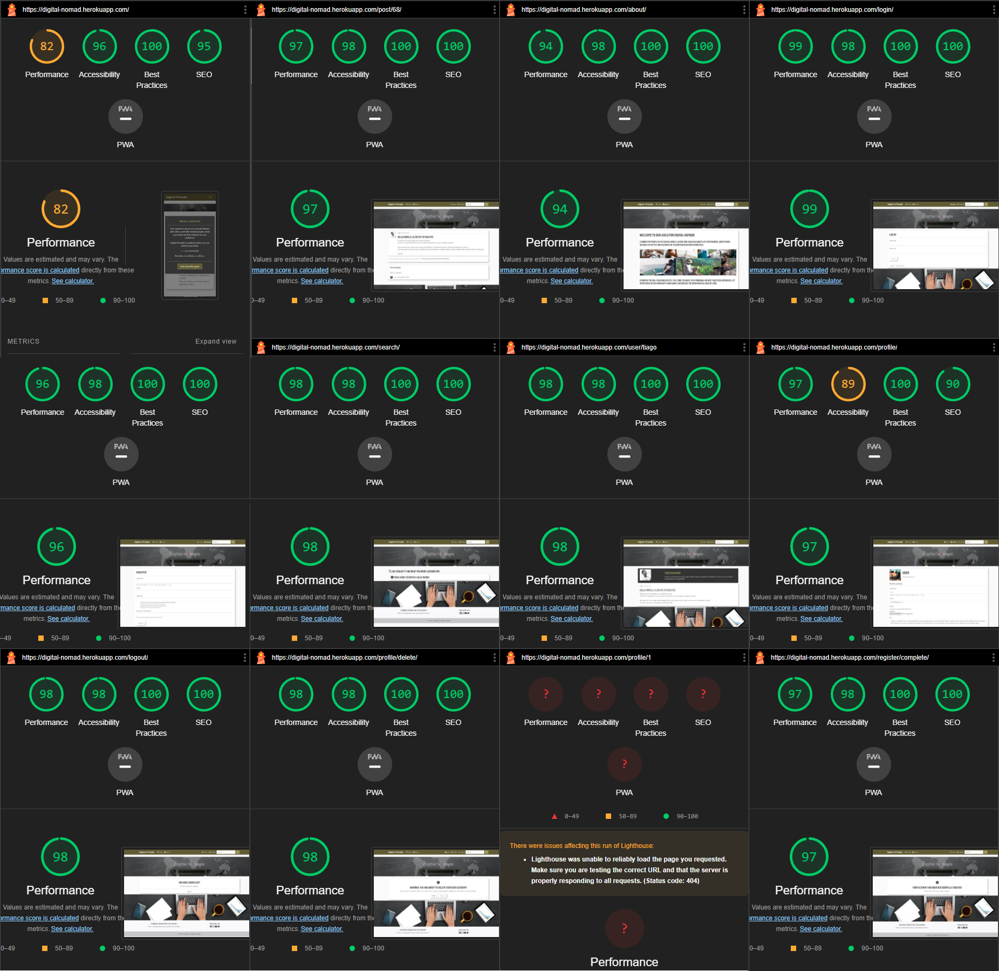
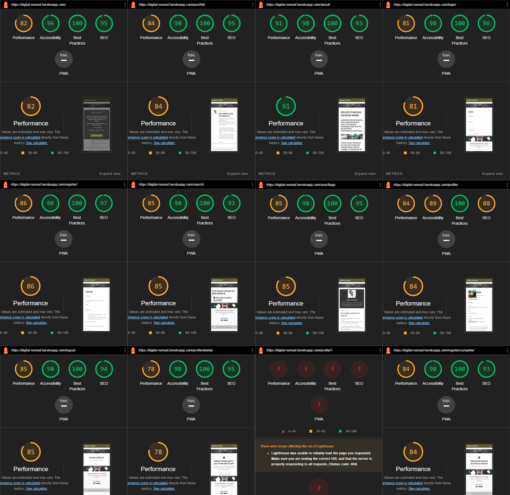

This website, under Ingognito mode, was scanned for Errors, Contrast Errors, Alerts, Features, Structural Elements and Aria for Desktop with Chromes extension [Wave](https://wave.webaim.org/).

In order to achieve auspicious ratings, the website underwent multiple changes on its styling in order to please both WAVE and Lighthouse.

After various examinations, tests and corrections for all its pages the website retrieved no withering Errors, whatsoever.
The website is responsive and displays a pleasing style to the viewers, with colors contrasting each other. Aria labels have been applied together with Structural Elements and Features.

Alerts have been retrieved, however, for Redundant links (example: links found in the navigation bar from base.html also found in the body of about.html), Suspicious alternative text and Skipped heading levels.

Refer to the templates names:
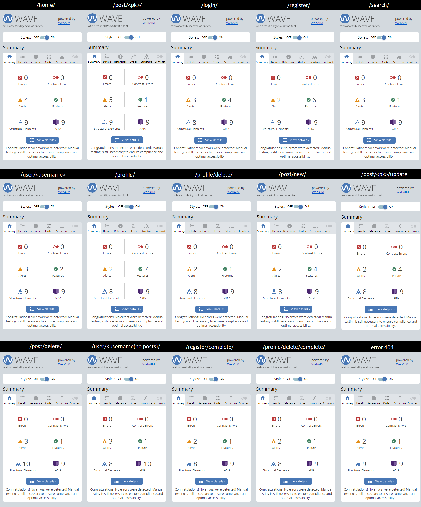

## Validation 
Via URL of the deployed website on Heroku, all pages were validated through validator.w3.org & jigsaw.w3.org.
No errors or warnings were found whatsoever, after several corrections have been applied with the exception of /register/

- The Developer investigated the error, but found no solution was found. The /register/ template has no such bootstrap class. When time allows, the error ought to suffer a correction.
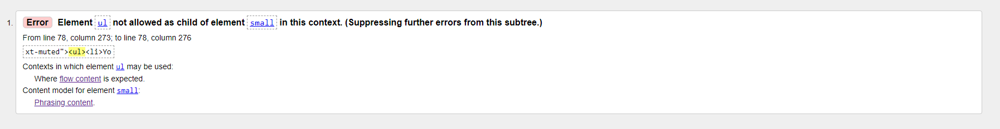

In order to comply with markup validity, the website coformed with w3validator.

Refer to the following links:
[home](https://validator.w3.org/nu/?doc=https%3A%2F%2Fdigital-nomad.herokuapp.com%2F)
[/about/](https://validator.w3.org/nu/?doc=https%3A%2F%2Fdigital-nomad.herokuapp.com%2Fabout%2F)
[/login/](https://validator.w3.org/nu/?doc=https%3A%2F%2Fdigital-nomad.herokuapp.com%2Flogin%2F)
[/logout/](https://validator.w3.org/nu/?doc=https%3A%2F%2Fdigital-nomad.herokuapp.com%2Flogout%2F)
[/register/](https://validator.w3.org/nu/?doc=https%3A%2F%2Fdigital-nomad.herokuapp.com%2Fregister%2F)
[/post/new/](https://validator.w3.org/nu/?doc=https%3A%2F%2Fdigital-nomad.herokuapp.com%2Fpost%2Fnew%2F)
[/post/update/](https://validator.w3.org/nu/?doc=https%3A%2F%2Fdigital-nomad.herokuapp.com%2Fpost%2F68%2Fupdate)
[/user/user/](https://validator.w3.org/nu/?doc=https%3A%2F%2Fdigital-nomad.herokuapp.com%2Fuser%2Fuser)

- Otherwise, the .html template structure and format passed through the official [W3validator](https://validator.w3.org/) with no issues whatsoever.
[See the report](https://validator.w3.org/nu/?doc=https%3A%2F%2Fdigital-nomad.herokuapp.com%2F)
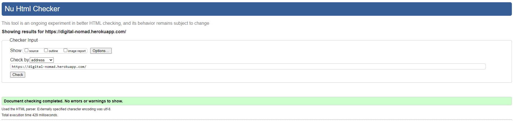

- The .css styling file was tested and validated through [W3jigsaw](https://jigsaw.w3.org/css-validator/) with no issues.
[See the report](https://jigsaw.w3.org/css-validator/validator?uri=https%3A%2F%2Fdigital-nomad.herokuapp.com%2F&profile=css3svg&usermedium=all&warning=1&vextwarning=&lang=en)
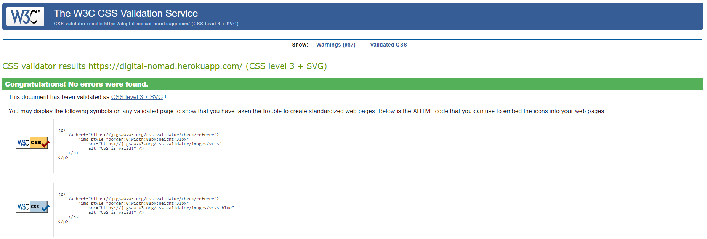

- The small excerpt with 2 functions of jQuery in home.html template, for the Modal, was test and validated through [JSHint](https://jshint.com/) with no issues whatsoever.
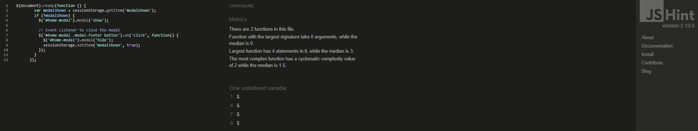

- The .py models, views and urls format were tested and validated through [Pep8CI](https://pep8ci.herokuapp.com/)
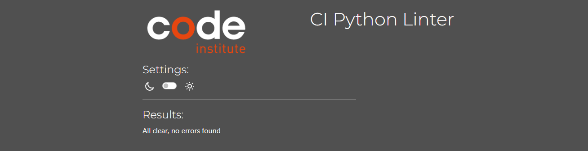

# Errors & Bugs
## Bug while Spamming
Upon manual testing, if a User creates a Post and the Post is submitted & written while spamming the same character/different characters but in the same paragraph, without a single space. The Title and Body exhibit a bug, where the text crosses over to the right side of the border of the Post model. (The same error was found, with ckeditor installed).

- Solution: Unsolved. No solution was founded The Posts should be written by a Human. (Ought to be fixed in the future, when time is available)

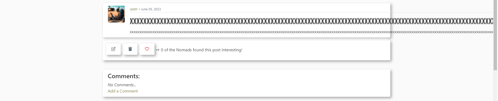

## Missing "etag" and assets"
Upon deploying the project to Heroku, the static files were either corrupted or missing. The ckeditor in particluar exhibited many errors and this resulted in frustration utltimatly leading the developer to abandon this type of RichTextEditor for the time being (Ought to be implemented in the future, perhaps post-assessment). Slow internet to upload a variety of assets of a Richtexteditor.

After ckeditor suffered a successful upload for its assets from the local static files to cloudinary, the developer still insisted on keeping the Posts model simple with TextField for the time being.

- Solution: Solved by deleting the static folder in Cloudinary, running "pip cache purge" in the terminal of working environment of GitPod and re-deploying on Heroku.

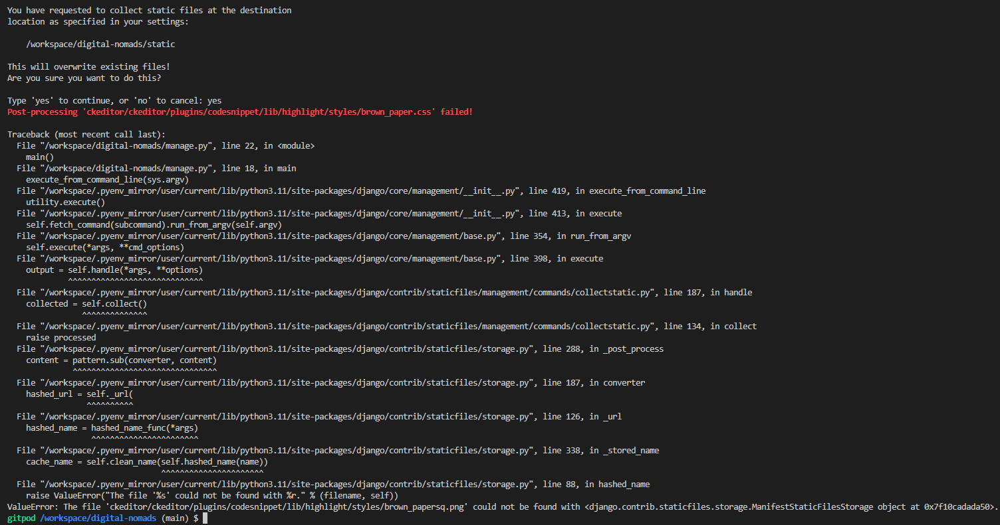

## Building Image
Upon opening the working environment, the repository displayed the same error over and over when trying to access the project on GitPod. This error is persistent and has been documented since CI-PP3(Python).

- Solution: Unsolved. Hit "Continue with Default Image" and start working.

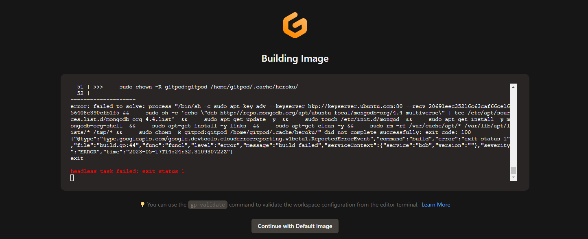

## Browser Compatibility
This website was tested on Chrome, Firefox and Microsoft Edge.
All browsers stated above were tolerant.

## Responsivness
The website was also tested through Chrome Developer tools for the following devices:

- iPhone SE
- iPhone XR
- iPhone 12Pro
- Pixel 5
- Samsung Galaxy S8+
- Samsung Galaxy S20 Ultra
- iPad Air
- iPad Mini
- Surface Pro 7
- Surface Duo
- Galaxy Fold
- Samsaung Galaxy A51/71
- Nest Hub
- Nest Hub Max